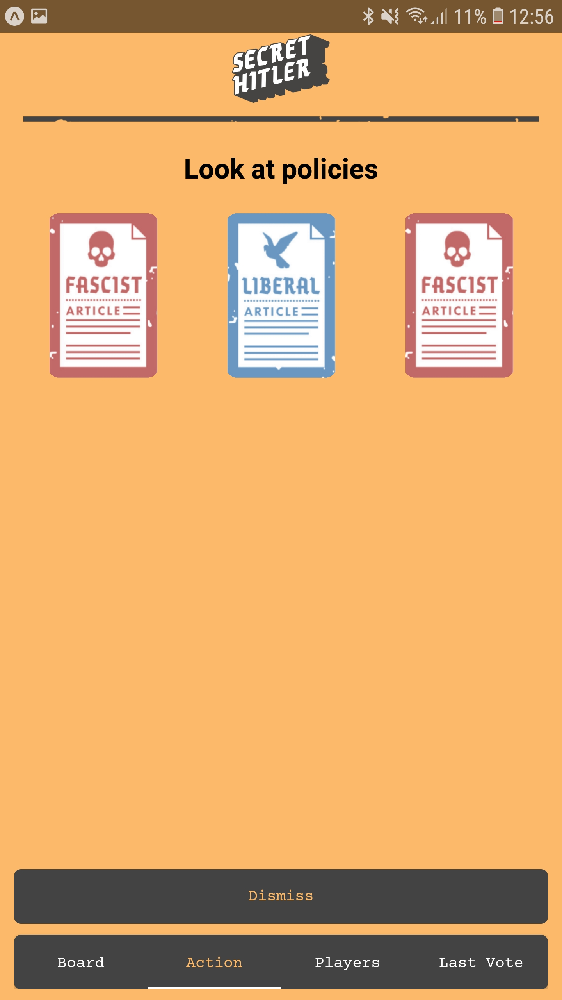

# secrethitler-client

This game is adaptation of board game https://www.secrethitler.com/ 

To start client:

* Install dependencies with `yarn install`
* Start expo server with `yarn start`
* Use expo mobile app to connect with expo server

## API

This client implement api of this backend:
https://github.com/mkaput/secrethitler-server

## Demo

Below are sample screenshots from current version of game:

### Log in:

### Lobby:

### Board

### Players screen

### Nomination

### Voting

### Dismiss policy

### Enact policy

### Last vote

### Eliminate player

### Look at future policies

### Check player loyality

### Next president choosing

### Dead player

### Game over

